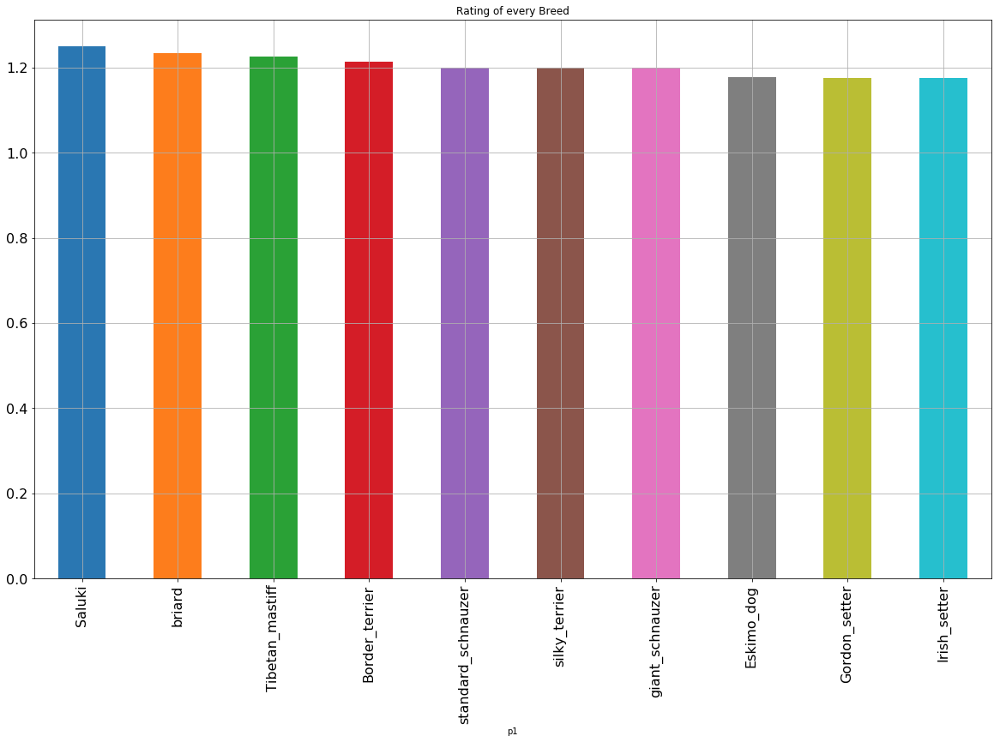

经过数据清洗之后可以展开分析。由于推文中基础档案从可以得到狗的评级，从图像预测成果中可以得到推文图片中对象和推测可靠度，从推特API获取成果中可以得到推文的转发量、点赞量。融合这些数据可以展开很多有趣的分析。本项目从以下三点展开。

## 1. 评级最高的Top_3 狗的品种
哪些品种的狗更容易拿到高评级呢？结合推文档案和图像预测成果可以找出评级（RATING）前三的狗的品种（p1），其中p1的可靠度最高，可以认为推文图片中就是该品种的狗。绘制柱状图，可以清晰看到各种狗评级的差距。由于狗的种类太多，就提取了评级均值前10的狗的品种绘制了柱状图，如下所示，

据此可知，Top5的狗的品种为 **Saluki，briard，Tibetan_mastiff，Border_terrier，standard_schnauzer**。
另外在推文图片中是狗的情况下，被提及最多的狗的品种统计情况，其中Top3为 **golden_retriever，Labrador_retriever，Pembroke**。可以推测这三种狗是较为常见的。

## 2. 推文中狗的评级和转发量、点赞量的相关性

推文是否在网络中有更广泛的讨论和关注可以通过转发量、点赞量和评论量等指标来分析。计算推文中狗的评级和转发量、点赞量之间的相关系数，分析它们之间的相关性。详细的分析成果可见wrangle_act.ipynb文件。
**可以做一个有趣的假设，如果给转发量点赞量赋予不同权重，建立推文影响力和转发量点赞量指标的关系函数，就可以分析出不同推特图文的网络影响力了**。

## 3. 如果推文中提到的对象不是狗，是否会影响转发量、点赞量和评级

推文中提到的不一定都是狗。这时带来多少转发量和点赞量，怎样的评级呢？**分析这个维度的意义就是博主推特维护做出短暂而有趣的改变时，网络影响力是否会有变化，粉丝对此的关注度会发生怎样的变化**。这可能可以让博主未来的推特维护有了更多的想象力。详细的分析成果可见wrangle_act.ipynb文件。

# 总结
对推文数据的挖掘和分析不仅仅至此。从更多维度去探索，可以在建立关于基于转发量、点赞量的推文影响力的模型，建立推特图文和推文影响力关系的模型。采用数据拟合、聚合分组的分析手段，有助于上述模型的建立。
